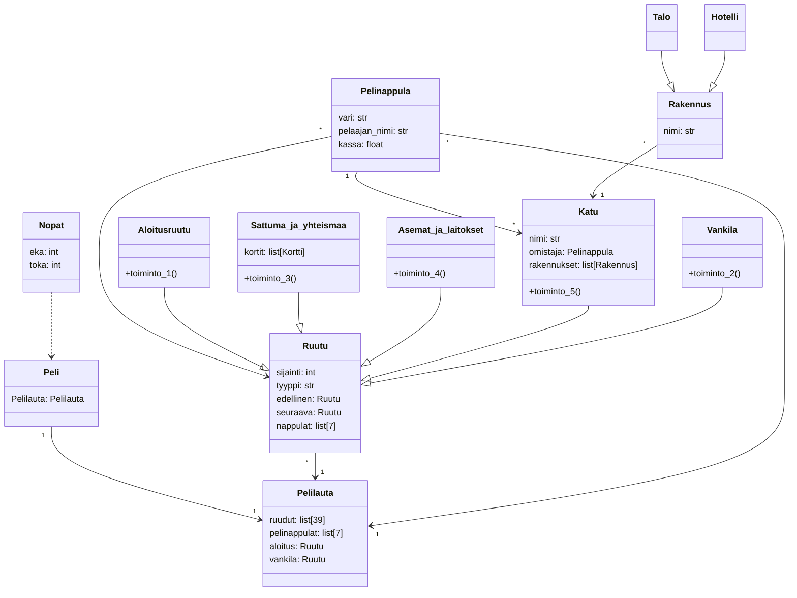

```mermaid
 classDiagram


    Peli "1" --> "1" Pelilauta
    Ruutu "*" --> "1" Pelilauta
    Pelinappula "*" --> "1" Ruutu
    Pelinappula "*" --> "1" Pelilauta
    Pelinappula "1" --> "*" Katu
    Nopat ..> Peli
    Rakennus "*" --> "1" Katu
    Aloitusruutu --|> Ruutu
    Sattuma_ja_yhteismaa --|> Ruutu
    Asemat_ja_laitokset --|> Ruutu
    Katu --|> Ruutu
    Vankila --|> Ruutu
    Talo --|> Rakennus
    Hotelli --|> Rakennus
  


    class Peli{
        Pelilauta: Pelilauta
      }

    class Pelilauta{
        ruudut: list[39]
        pelinappulat: list[7]
        aloitus: Ruutu
        vankila: Ruutu
      }

    class Ruutu{
        sijainti: int
        tyyppi: str
        edellinen: Ruutu
        seuraava: Ruutu
        nappulat: list[7]
      }

    class Aloitusruutu{
        +toiminto_1()
    }

    class Vankila{
        +toiminto_2()
    }

    class Sattuma_ja_yhteismaa{
        kortit: list[Kortti]
        +toiminto_3()
    }

    class Asemat_ja_laitokset{
        +toiminto_4()
    }

    class Katu{
        nimi: str
        omistaja: Pelinappula
        rakennukset: list[Rakennus]
        +toiminto_5()
    }


    class Pelinappula{
        vari: str
        pelaajan_nimi: str
        kassa: float
      }

    class Nopat{
        eka: int
        toka: int
    }

    class Rakennus{
        nimi: str
    }

    class Talo{

    }

    class Hotelli{

    }
```

