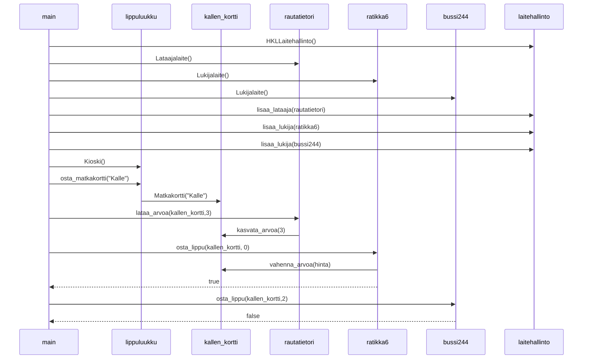

```mermaid
sequenceDiagram 

    participant main
    participant lippuluukku
    participant kallen_kortti
    participant rautatietori
    participant ratikka6
    participant bussi244
    participant laitehallinto

    main ->> laitehallinto: HKLLaitehallinto()
    main ->> rautatietori: Lataajalaite()
    main ->> ratikka6: Lukijalaite()
    main ->> bussi244: Lukijalaite()

    main ->> laitehallinto: lisaa_lataaja(rautatietori)
    main ->> laitehallinto: lisaa_lukija(ratikka6)
    main ->> laitehallinto: lisaa_lukija(bussi244)

    main ->> lippuluukku: Kioski()
    main ->> lippuluukku: osta_matkakortti("Kalle")
    lippuluukku ->> kallen_kortti: Matkakortti("Kalle")

    main ->> rautatietori: lataa_arvoa(kallen_kortti,3)
    rautatietori ->> kallen_kortti: kasvata_arvoa(3)

    main ->> ratikka6: osta_lippu(kallen_kortti, 0)
    ratikka6 ->> kallen_kortti: vahenna_arvoa(hinta)
    ratikka6 -->> main: true 

    main ->> bussi244: osta_lippu(kallen_kortti,2)
    bussi244 -->> main: false
```
