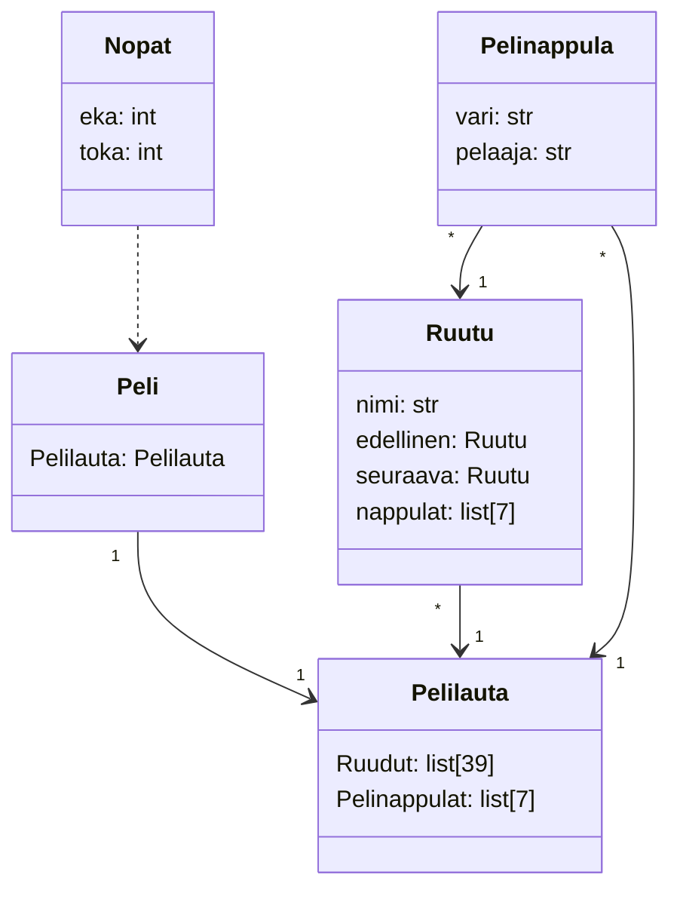

```mermaid
classDiagram


    Peli "1" --> "1" Pelilauta
    Ruutu "*" --> "1" Pelilauta
    Pelinappula "*" --> "1" Ruutu
    Pelinappula "*" --> "1" Pelilauta
    Nopat ..> Peli


    class Peli{
        Pelilauta: Pelilauta
      }

    class Pelilauta{
        Ruudut: list[39]
        Pelinappulat: list[7]
      }

    class Ruutu{
        nimi: str
        edellinen: Ruutu
        seuraava: Ruutu
        nappulat: list[7]
        
      }

    class Pelinappula{
        vari: str
        pelaaja: str
      }

    class Nopat{
        eka: int
        toka: int
    }
```
