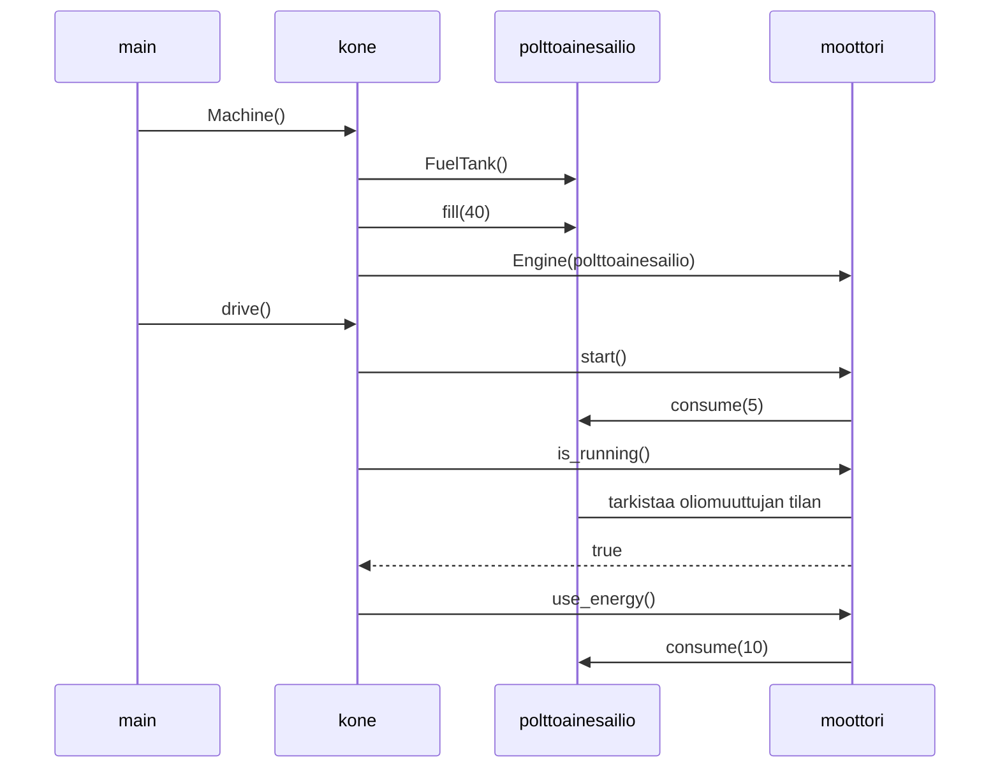

```mermaid
sequenceDiagram 

    participant main
    participant kone
    participant polttoainesailio
    participant moottori

    main ->> kone: Machine()
    kone ->> polttoainesailio: FuelTank()
    kone ->> polttoainesailio: fill(40)
    kone ->> moottori: Engine(polttoainesailio)

    main ->> kone: drive()
    kone ->> moottori: start()
    moottori ->> polttoainesailio: consume(5)
    kone ->> moottori: is_running()

    polttoainesailio -> moottori: tarkistaa oliomuuttujan tilan
    moottori -->> kone: true
    
    kone ->> moottori: use_energy()
    moottori ->> polttoainesailio: consume(10)
```
